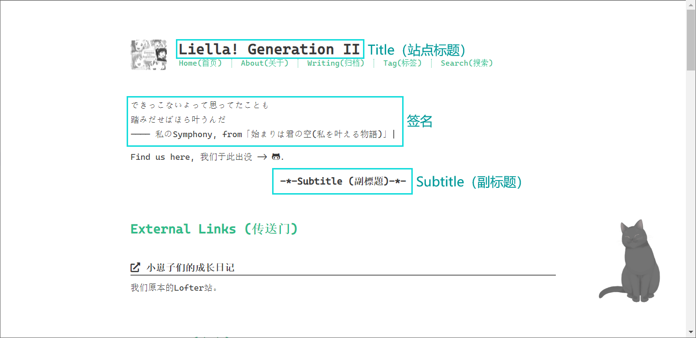

示意

## Title (站点标题)

***这一项的内容将会显示在本站的主页与各个功能页面的最上方，限制为文字形式且字数不宜过多!!***

1. Liella! Generation II
   (中文意为 `Liella!第二世代` )

2. Liella! 第二世代

3. 小崽子们的成长日记

4. ... ... 如若有其他想法，欢迎在投票正式开始之前提名

## Subtitle (站点副标题)

***这一项的内容将会显示在本站的主页的签名位下方，限制为文字形式但字数限制稍宽松。***

1. ... ... 暂无想法，欢迎在投票正式开始之前提名

## 列表默认序号形式

* 类型1 Aiueo (日文字符，罗马音序)
   <ol style="list-style-type:katakana">
      <li>云上云上，云之所向</li>
      <li>念念不忘，终有回响</li>
      <li>Can+u see this future is right now</li>
      <li>Cause my voice is always going around</li>
   </ol>

* 类型2 Iroha (日文字符，一二三序)
   <ol style="list-style-type:katakana-iroha">
      <li>云上云上，云之所向</li>
      <li>念念不忘，终有回响</li>
      <li>Can+u see this future is right now</li>
      <li>Cause my voice is always going around</li>
   </ol>

* 类型3 Decimal (数字)
   <ol>
      <li>云上云上，云之所向</li>
      <li>念念不忘，终有回响</li>
      <li>Can+u see this future is right now</li>
      <li>Cause my voice is always going around</li>
   </ol>

* 类型4 Decimal, with zero leading (数字，带有前导零)
   <ol style="list-style-type:decimal-leading-zero">
      <li>云上云上，云之所向</li>
      <li>念念不忘，终有回响</li>
      <li>Can+u see this future is right now</li>
      <li>Cause my voice is always going around</li>
   </ol>

* 类型5 Alphabets (英文字母)
   <ol style="list-style-type:lower-alpha">
      <li>云上云上，云之所向</li>
      <li>念念不忘，终有回响</li>
      <li>Can+u see this future is right now</li>
      <li>Cause my voice is always going around</li>
   </ol>

* 类型6 Greek (希腊字母)
   <ol style="list-style-type:lower-greek">
      <li>云上云上，云之所向</li>
      <li>念念不忘，终有回响</li>
      <li>Can+u see this future is right now</li>
      <li>Cause my voice is always going around</li>
   </ol>

* 类型7 Hebrew (希伯来字母)
   <ol style="list-style-type:hebrew">
      <li>云上云上，云之所向</li>
      <li>念念不忘，终有回响</li>
      <li>Can+u see this future is right now</li>
      <li>Cause my voice is always going around</li>
   </ol>

## 站点签名·内容

***这一项的内容将会显示在本站主页的签名位置，限制为文字形式!!***

1. [***Liella!***](https://zh.moegirl.org.cn/Liella!)的某首曲子的一段歌词，
   具体选曲与歌词选择将在后面与大家共同商议

2. 群里老师写的文章中截取精彩的一段，
   具体选段将在后面与大家共同商议

3. ... ... 如若有其他想法，欢迎在投票正式开始之前提名

## 站点签名·颜色

1. ████████████████ 颜色1, 饱和度=0%
2. ████████████████ 颜色2, 饱和度=40%
3. ████████████████ 颜色3, 饱和度=66.7%
4. ████████████████ 颜色4, 饱和度=85.7%
5. ████████████████ 颜色5, 饱和度=100%

上述涉及五种颜色的表达式

| hex | r | g | b |
|-----|--:|---|:--|
| #4c4c4c | 76 | 76 |  76 |
| #39395f | 57 | 57 |  95 |
| #262672 | 38 | 38 | 114 |
| #131385 | 19 | 19 | 133 |
| #000098 |  0 |  0 | 152 |
